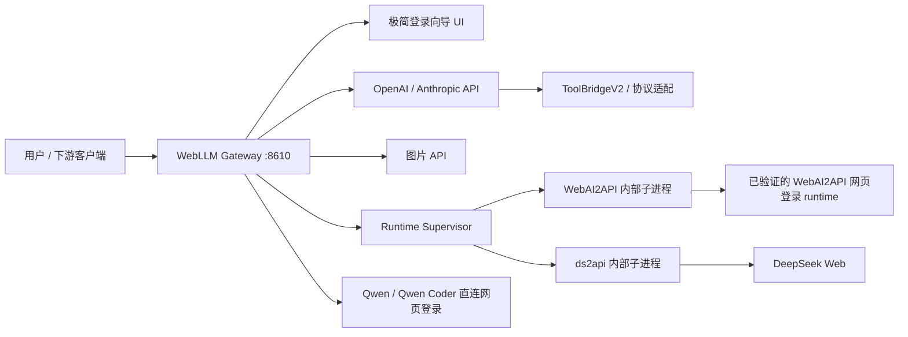

# WebLLM Gateway Architecture

WebLLM Gateway 是一个网页登录模型 API 网关。它把 Qwen Web、DeepSeek Web、ChatGPT/WebAI2API 等网页登录上游包装成 OpenAI / Anthropic 兼容 API，同时把不稳定的网页模型文本工具调用转换成稳定的标准工具协议。

2026-07-18 的完整分层说明、ds2api v4.6.1 parity 矩阵和稳定性审计见 [ds2api-parity-stability-2026-07-18.md](ds2api-parity-stability-2026-07-18.md)。



## 设计边界

- Gateway 是协议层和适配层，不是 agent runtime。
- Gateway 不执行本地工具，不接管 MCP、终端、文件系统或浏览器自动化权限。
- 下游客户端负责 agent loop、工具注册、工具执行、权限确认和审计。
- Provider 负责网页登录态和网页模型交互；工具协议修复集中在 Gateway。
- 新兼容逻辑优先抽象成 provider capability、model capability 或 Gateway 配置，避免按单一客户端写分支。

## 目录结构

```text
webai_gateway/
  app.py                    FastAPI 应用、路由、provider 调度、管理 API、媒体接口
  config.py                 配置 dataclass、加载、保存、前端/admin 序列化
  openai_api.py             OpenAI chat/completions 请求构造、响应解析、SSE、恢复提示
  anthropic_api.py          Anthropic messages 与 OpenAI chat 的双向转换
  tool_bridge.py            ToolBridgeV2 prompt 协议、解析、repair、工具暴露策略
  tool_controller.py        工具桥结果分类、repair/ask-user/final 决策
  prompt_compaction.py      长上下文压缩、ds2api 风格历史渲染
  web_auth.py               provider 目录、网页登录授权、credential store
  deepseek_web.py           DeepSeek Web 经 ds2api sidecar 调用
  qwen_web.py               Qwen Web 直连 provider
  qwen_coder.py             Qwen Coder 直连 provider
  runtime_supervisor.py     单入口启动时托管 WebAI2API / ds2api 内部 runtime
  model_ids.py              模型 ID 清洗和规范化
  ds2api_oracle.py          当前锁定的 ds2api oracle 版本
  static/                   轻量内置控制台资源
webui/                      Vue 3 控制台
tests/                      协议、工具桥、provider、parity、回归测试
docs/                       架构、发布、专项设计和排查文档
examples/                   Mock upstream 和示例请求
```

## 请求链路

### OpenAI Chat

1. 下游调用 `POST /v1/chat/completions`。
2. `app.py` 鉴权、规范化模型 ID，并判断路由：direct provider、ds2api provider 或 WebAI2API upstream。
3. `openai_api.build_upstream_payload()` 根据 `tool_bridge.activationPolicy` 决定是否注入 ToolBridge prompt。
4. 网页模型返回文本后，`openai_api.parse_chat_response()` 和 `tool_bridge.parse_tool_response()` 解析为标准 `message.tool_calls` 或普通 assistant 文本。
5. 解析失败、空输出、工具名不合法、必选工具未调用等情况由 `tool_controller.py` 决策是否 repair、重试、要求下游继续工具循环，或返回诊断。

### Anthropic Messages

1. 下游调用 `POST /v1/messages`。
2. `anthropic_api.anthropic_body_to_openai()` 将 system/messages/tools/tool_result 转成 OpenAI chat 结构。
3. 后续复用 OpenAI Chat 和 ToolBridge 主链路。
4. `anthropic_api.openai_response_to_anthropic()` 将标准 `tool_calls` 转回 Anthropic `tool_use`，文本转回 text block。
5. 流式响应由 `anthropic_response_to_sse()` 生成 Anthropic SSE 事件。

### ToolBridgeV2

ToolBridgeV2 的目标是让不支持原生工具协议的网页模型只看到一份严格文本协议：

```json
{
  "calls": [
    {
      "id": "call_1",
      "name": "tool_name",
      "input": {}
    }
  ]
}
```

核心规则：

- 不把 OpenAI/Anthropic 原生 `tools` 直接发给网页登录模型。
- 模型需要工具时，assistant content 必须为空，下游只收到标准 `tool_calls` / `tool_use`。
- 工具名、输入对象、重复 ID、单轮调用数量都在 Gateway 层校验。
- OpenAI `role=tool` 和 Anthropic `tool_result` 会被转成 observation 文本，并按 `tool_bridge.observationPolicy` 压缩。
- ds2api XML/DSML 兼容行为由 parity/oracle 测试保护。

### Provider 路由

- `deepseek-v4-pro`：通过 `deepseek_web.py` 转发到本地 ds2api sidecar，默认 `http://127.0.0.1:9331/v1`。
- `qwen-web/*`：通过 `qwen_web.py` 使用 Qwen 网页登录态直连。
- `qwen-coder/*`：通过 `qwen_coder.py` 使用 Qwen Coder 网页登录态直连。
- ChatGPT、LMArena、豆包等已验证或候选能力：通过 WebAI2API sidecar，默认 `http://127.0.0.1:8500/v1`。
- `gpt-image-2` / `gpt-image-1.5`：通过 `/v1/images/generations` 包装 WebAI2API ChatGPT 图像链路。
- 未通过真实链路验证的媒体/视频模型不会出现在默认用户入口和公开模型目录中。

### 单入口登录和运行态

- 用户只需要启动 `start_webai_gateway.bat` 并访问 `http://127.0.0.1:8610/`。
- `runtime_supervisor.py` 会在启动时检查并托管 WebAI2API 和 ds2api 内部 runtime；用户界面不再暴露 WebAI2API 的完整后台管理导航。
- WebAI2API 只作为网页登录授权、账号检测、模型目录和网页调用能力使用；Gateway 对外仍只暴露 OpenAI / Anthropic 兼容 API。
- `/health` 返回 `runtime.supervisor`，用于确认单入口、公开端口、内部 runtime 状态和失败摘要。
- `credentials/` 保存本地网页登录凭证，默认被 `.gitignore` 排除。
- `.webai-gateway/` 保存账户索引、浏览器 profile、sidecar 日志等运行态，默认被 `.gitignore` 排除。
- `data/`、`logs/`、`.codex-logs/`、`.tmp/` 都不应进入开源仓库。
- Gateway 日志、错误、测试输出必须走敏感信息脱敏，不能暴露 cookie、bearer、session token 或 API key。

## 配置层

主配置文件是 `config.json`，默认从 `config.example.json` 复制生成。关键配置：

- `server.host` / `server.port` / `server.apiKey`：本地服务和鉴权。
- `upstream.baseUrl` / `upstream.apiKey`：WebAI2API OpenAI-compatible upstream。
- `providerRuntime.requestTimeoutSeconds`：网页登录 provider 单次请求超时。
- `providerRuntime.promptMaxChars`：网页模型输入预算。
- `providerRuntime.deepseekDs2api*`：DeepSeek ds2api sidecar 地址、并发和 429 cooldown。
- `providerRuntime.qwenWebBackend` / `gptThinkingBackend`：特定模型族后端选择。
- `tool_bridge.*`：工具桥激活、暴露、调用数量、schema 预算、observation 压缩策略。

新增配置时必须同步：

- `config.example.json`
- `webai_gateway/config.py` 的 `load_config()` / `update_config()`
- `config_to_public()` / `config_to_admin()`
- 前端设置页
- 至少一个后端测试

## 测试体系

- `tests/test_gateway.py`：主回归套件，覆盖路由、provider、工具桥、媒体接口、脱敏、配置和管理 API。
- `tests/test_client_compat_matrix.py`：OpenAI / Anthropic 客户端兼容矩阵。
- `tests/test_ds2api_parity.py`：与 ds2api oracle 的差分和协议 parity。
- `tests/test_tool_bridge_replay.py`：真实失败样本 replay。
- `tests/test_startup_scripts.py`：Windows 启动脚本行为保护。
- `webui`：前端用 `pnpm build` 做构建验证。

开源前最低验证：

```powershell
python -m pytest -q
cd webui
pnpm build
```

涉及网页登录 provider 的改动还需要手动 E2E：

- 普通聊天返回文本。
- 工具请求返回标准 tool call。
- 工具结果回传后继续回答。
- 图像/视频接口返回可取回的媒体结果。
