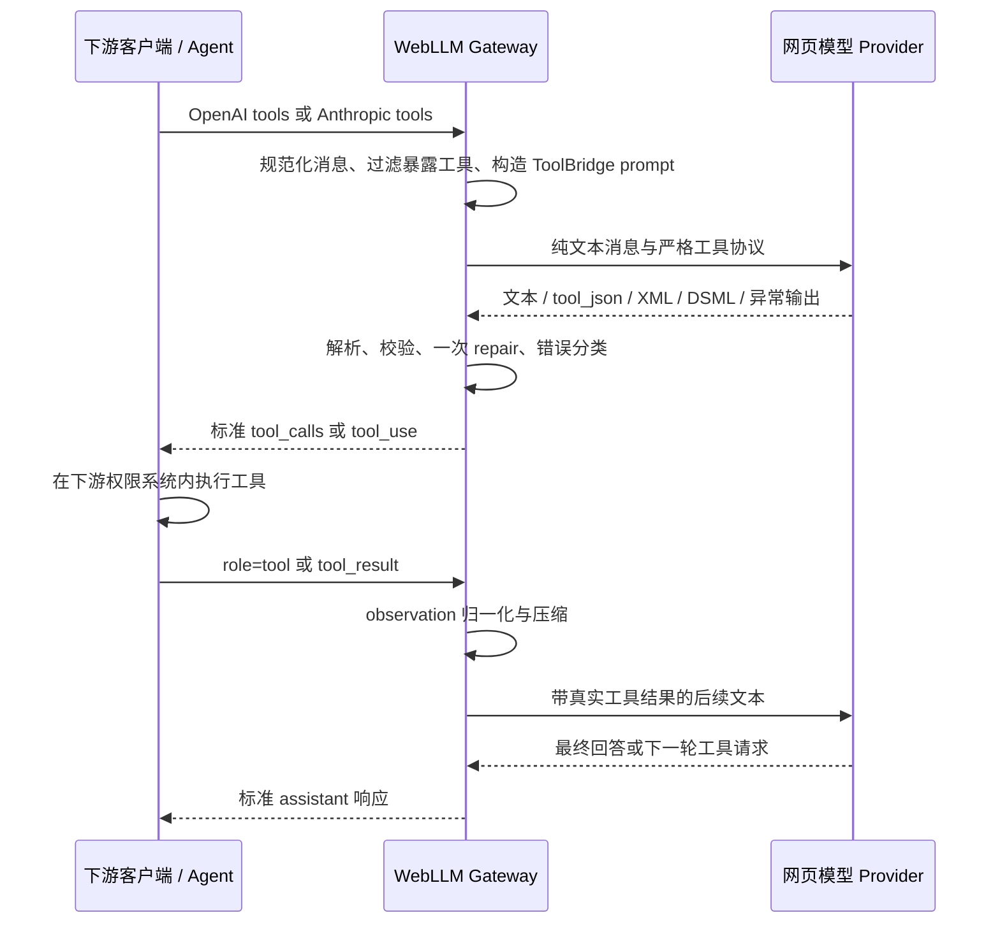
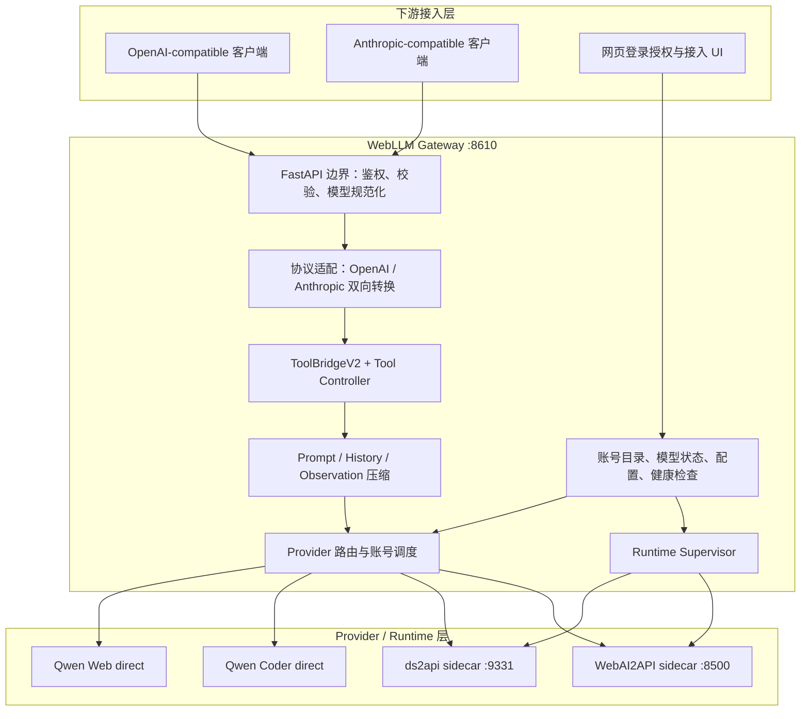

# WebLLM Gateway 架构、ds2api 对标与稳定性审计（2026-07-18）

## 1. 结论摘要

WebLLM Gateway 的本质不是模型代理，也不是 agent runtime，而是一个“协议稳定器”：它把 Qwen Web、DeepSeek Web、WebAI2API 等网页登录模型的不稳定文本交互，收敛成 OpenAI / Anthropic 兼容接口，并把网页模型输出的文本工具协议校验、修复为标准 `tool_calls` / `tool_use`。

本轮对标基线是 `CJackHwang/ds2api`：

- 版本：`v4.6.1`
- commit：`8316cf8a0352e900e03ce600b792083f590d80e2`
- 2026-07-18 首次检查、2026-07-19 发布前再次 fetch 后，`origin/main` 均与上述 commit 一致
- 上游许可证：AGPL-3.0
- Gateway 许可证：MIT

因此，本项目采用“外部可选 runtime + 行为 oracle + 独立实现”的边界：DeepSeek 链路可以调用本地 ds2api sidecar，测试可以用锁定源码生成 oracle，但不把 ds2api 源码或二进制混入 Gateway 的 MIT 发布物。若部署者修改、托管或捆绑 ds2api，仍需自行履行 AGPL-3.0 义务。

本轮代码级审计确认并修复了十类成功率问题：

1. 对齐 ds2api v4.6.1 的 Markdown 反引号语义，并把所有兼容 extractor 统一接入等长 masked scan，避免 inline code、普通 fence、CDATA 中的示例被误判成真实工具调用，同时保留“不闭合反引号之后的真实工具调用”。
2. 对齐空输出错误分类：仅有 reasoning/thinking 时是 `429 upstream_empty_output`，完全无输出时是 `503 upstream_unavailable`。
3. Qwen / Qwen Coder 的限流冷却从路由全局粒度改为逐账号粒度，一个账号 429 不再阻塞仍可用的备用账号。
4. 未固定账号的请求会跳过未授权的 current 账号，并在 429 或授权过期时仅切换一次到已授权备用账号；显式固定账号仍保持 fail-closed。
5. 删除 Gateway 对 ds2api 终态 429 的 1/3/8 秒整请求重放，避免与 ds2api 自带的同会话 empty-output retry 叠加成最坏 8 次 completion。
6. 凭证授权改为严格值判定，空白、`null/undefined/none/nil`、空壳 `Bearer` 和 metadata-only Qwen session 不再被视为已登录；损坏的 credential JSON 也不会再让控制面直接崩溃。
7. Qwen 浏览器授权验真从“HTTP 2xx 即成功”收紧为“原 auth endpoint + JSON + 非访客用户身份”，拒绝跳转后的登录 HTML 和访客 JSON。
8. 清除 provider 授权时同步删除 legacy credential 与该 provider 的所有 direct profile，避免 UI 显示已清除但请求仍复用残留登录态。
9. CredentialStore 保存/清除改为同一存储锁下串行，并用 revision 阻止删除前启动的后台授权任务在完成后“复活”旧凭证。
10. Qwen 401/403 按账号和非敏感 credential revision 暂时隔离；后续未固定请求直接使用健康备用账号，凭证更新后自动恢复候选。

这些结论表示实现和回归向量已经落地，不等同于发布完成。全量后端测试、前端构建、真实网页登录 E2E、服务重启和健康检查结果应由本轮最终交付报告补齐。

## 2. 系统原理

### 2.1 核心问题

网页模型和标准 API 模型的运行假设不同：

- 网页上游通常只接收自然语言文本，不原生理解 OpenAI `tools` 或 Anthropic `tools`。
- 网页输出可能混入 reasoning、Markdown、XML/DSML、坏 JSON、半截标签、自然语言承诺或重复工具调用。
- 登录态、账号限流和网页接口会独立失效；同一 provider 的不同账号健康度也不同。
- 下游 agent 需要严格、可判定、可重放的工具调用结构，不能根据自然语言猜测模型是否真的调用了工具。

Gateway 将上述不确定性封装在 provider 和协议适配边界内，对下游暴露稳定的数据结构和明确错误。

### 2.2 工具闭环



关键不变量是：Gateway 只转换协议，不执行工具。终端、文件、浏览器、MCP、插件、技能、权限确认和审计始终由下游客户端负责。

## 3. 分层架构



### 3.1 API 边界层

主要入口位于 [`webai_gateway/app.py`](../webai_gateway/app.py)：

- `POST /v1/chat/completions`：主要 OpenAI-compatible 入口。
- `POST /v1/messages`：Anthropic-compatible 工具闭环入口。
- `GET /v1/models`：仅暴露已验证、可供用户调用的模型，并允许附带非破坏性的 capability metadata。
- `GET /health`：汇总 Gateway、runtime supervisor、oracle source freshness 和内部 sidecar 状态。

该层负责鉴权、模型 ID 规范化、请求校验、路由和错误映射，不负责执行下游工具。

### 3.2 协议适配层

- [`webai_gateway/openai_api.py`](../webai_gateway/openai_api.py) 负责 OpenAI 请求构造、响应解析、SSE 和恢复提示。
- [`webai_gateway/anthropic_api.py`](../webai_gateway/anthropic_api.py) 把 Anthropic `system/messages/tools/tool_result` 转为内部 OpenAI chat 结构，再把 `tool_calls` 转回 `tool_use`。
- 两个接口复用同一套工具解析，不维护两份可能漂移的 parser。

### 3.3 ToolBridge 与历史层

- [`webai_gateway/tool_bridge.py`](../webai_gateway/tool_bridge.py) 负责工具 schema 暴露、严格 prompt、`tool_json`/XML/DSML 解析、参数校验和一次 repair。
- [`webai_gateway/tool_controller.py`](../webai_gateway/tool_controller.py) 根据解析结果决定继续、repair、要求真实工具调用或返回诊断。
- [`webai_gateway/prompt_compaction.py`](../webai_gateway/prompt_compaction.py) 把历史、`role=tool` / `tool_result` 和长 observation 压缩成网页模型可以稳定消费的文本，同时保留最新任务和协议指令。
- [`webai_gateway/assistant_turn.py`](../webai_gateway/assistant_turn.py) 把 visible text、thinking、工具调用和空输出收敛为一轮明确状态。

项目首选一个 fenced `tool_json` block；XML/DSML 是为了兼容 ds2api 和网页模型漂移的输入容错面，不是下游输出协议。下游始终收到标准 OpenAI / Anthropic 结构。

### 3.4 Provider 与账号调度层

- DeepSeek：[`webai_gateway/deepseek_web.py`](../webai_gateway/deepseek_web.py) 调用本地 ds2api sidecar，默认 `http://127.0.0.1:9331/v1`。
- Qwen Web：[`webai_gateway/qwen_web.py`](../webai_gateway/qwen_web.py) 使用本地网页登录态直连。
- Qwen Coder：[`webai_gateway/qwen_coder.py`](../webai_gateway/qwen_coder.py) 使用独立 provider 适配器直连。
- ChatGPT、LMArena 等：经 WebAI2API sidecar，默认 `http://127.0.0.1:8500/v1`。

账号调度以“已授权账号集合”为候选池，并在账号维度管理 inflight、队列和 cooldown。显式 target 账号表示调用方要求确定性，因此不会静默换号；未固定账号才允许有限故障转移。

### 3.5 控制面与运行时层

- [`webai_gateway/web_auth.py`](../webai_gateway/web_auth.py) 管理 provider 目录、授权状态和 credential store。
- [`webai_gateway/runtime_supervisor.py`](../webai_gateway/runtime_supervisor.py) 检查并托管可选 sidecar。
- [`webai_gateway/ds2api_oracle.py`](../webai_gateway/ds2api_oracle.py) 固定 oracle commit/version。
- `credentials/`、`.webai-gateway/`、`data/`、浏览器 profile 和 sidecar 日志属于本地运行态，不进入仓库，也不应出现在日志、测试输出或错误正文中。

## 4. 请求链路

### 4.1 OpenAI 普通聊天

1. `app.py` 校验 API key、模型和请求结构。
2. 根据模型 capability 路由到 Qwen direct、ds2api sidecar 或 WebAI2API。
3. 普通问答在 `tool_bridge.activationPolicy=auto` 下不必注入工具协议。
4. provider 返回后统一整理为 OpenAI Chat Completions；空白响应不能作为无内容 assistant 静默返回。

### 4.2 OpenAI 工具请求

1. `openai_api.py` 规范化 `tools` 与 `tool_choice`。
2. ToolBridge 根据暴露策略过滤不应直接交给网页模型的本地 runtime 类工具。
3. 工具 schema、允许工具名、调用约束和历史被编码为纯文本 prompt；原生 `tools/tool_choice` 不直接透传给不支持原生工具的网页上游。
4. 网页输出经过 parser、允许列表、object 参数、重复 call id 和单轮数量校验。
5. 成功时 assistant content 为空，`finish_reason=tool_calls`；失败时最多 repair 一次，并返回可观察诊断，不能把原始坏 JSON 当普通回答泄漏给下游。

### 4.3 Anthropic Messages

1. `anthropic_api.py` 将 Anthropic blocks 转换为内部 OpenAI chat 消息。
2. 后续复用同一个 ToolBridge、provider 路由和历史压缩链路。
3. 标准 `tool_calls` 转回 `tool_use`，`role=tool` 语义转回 `tool_result` 闭环。
4. 当前只承诺项目规范列出的最小闭环；复杂 image、computer-use、server-side thinking 等不在本轮 parity 承诺内。

### 4.4 DeepSeek sidecar

1. Gateway 确认 ds2api runtime 可连接。
2. `deepseek_web.py` 把允许字段和规范化模型 ID 发往 sidecar。
3. ds2api 负责 DeepSeek 网页协议、流事件收集、tool parser 和上游错误。
4. ds2api 在同一 session 内完成一次 empty-output retry，并复用 `parent_message_id`、获取新 PoW；Gateway 不再对其终态 429 重新创建会话并重放整笔请求。
5. Gateway 对 sidecar 的本地连接失败、授权失败、429、空输出和一般 HTTP 错误做面向用户的分层提示；`upstream_empty_output` 只会冷却下一笔独立请求。

## 5. ds2api v4.6.1 对标方法

### 5.1 固定来源

| 项目 | 值 |
|---|---|
| 上游仓库 | `https://github.com/CJackHwang/ds2api` |
| 上游 ref | `origin/main` / `v4.6.1` |
| 精确 commit | `8316cf8a0352e900e03ce600b792083f590d80e2` |
| Gateway 锁定位置 | `webai_gateway/ds2api_oracle.py` |
| 上游许可证 | AGPL-3.0 |
| Gateway 许可证 | MIT |

开发前先 fetch 上游，再比较 `origin/main` 与 Gateway oracle。若上游变化，必须先更新锁定版本和差分用例，不能在旧 oracle 上继续宣称“最新版一致”。

### 5.2 Parity 矩阵

| 表面 | ds2api v4.6.1 参考 | Gateway 实现 | 当前结论 |
|---|---|---|---|
| Oracle 版本与新鲜度 | tag、commit、`internal/version` | `ds2api_oracle.py`、`/health` | 精确锁定；健康检查可识别源码是否落后，但不等于校验正在运行的 sidecar 二进制 |
| OpenAI 请求规范化 | `internal/promptcompat/request_normalize.go` | `app.py`、`openai_api.py`、`model_ids.py` | 核心字段和 `tool_choice` 行为对标；Gateway 增加多 provider 路由 |
| 工具 prompt | `internal/toolcall/tool_prompt.go`、`internal/promptcompat/prompt_build.go` | `tool_bridge.py` | 行为对标；Gateway 首选 fenced `tool_json`，同时兼容 ds2api XML/DSML |
| 历史与工具结果 | `internal/promptcompat/message_normalize.go`、`history_transcript.go` | `prompt_compaction.py`、`openai_api.py` | ds2api 风格 transcript 和工具往返已复用；Gateway 额外提供可配置 observation 压缩 |
| 非流式工具解析 | `internal/toolcall/*` 及其测试 | `tool_bridge.py` | 通过 oracle 差分覆盖 canonical、DSML、CDATA、标量/数组、缺失 wrapper、Markdown fence/inline code 等行为 |
| 流式 tool sieve | `internal/toolstream/*`、Node sieve | 流式上游先缓冲，再在完整轮次生成标准 tool call chunk | 轮次末语义对标；不承诺逐字符/逐 chunk 的时序完全一致 |
| Assistant turn 判定 | `internal/assistantturn/turn.go` | `assistant_turn.py` | 工具调用、required violation、content filter、thinking-only 429、pure-empty 503 语义对齐 |
| OpenAI tool call / SSE 形态 | `internal/assistantturn`、`internal/sse`、HTTP formatter | `openai_api.py` | 标准 tool call 和完成态由差分 snapshot 保护；Gateway 以稳定完整 chunk 优先 |
| DeepSeek 网页调用 | `internal/deepseek`、`internal/server` | `deepseek_web.py` 调用 ds2api sidecar | 属于委托一致：准确度取决于实际运行 sidecar 的版本和账号状态 |
| 模型目录 | ds2api config/model resolution | `web_auth.py`、`model_ids.py`、`/v1/models` | 刻意不是全集复制；只公开已验证、当前可用模型 |
| Anthropic 接口 | `internal/claudeconv` 等 | `anthropic_api.py` | 只对标项目需要的最小工具闭环；复杂 blocks 与 server thinking 是明确非目标 |
| Responses API / 上游完整管理面 | ds2api 对应 route、WebUI、history | Gateway 未按 ds2api UI/route 全量复制 | 刻意差异；Gateway 产品面是统一登录向导和 OpenAI / Anthropic 网关 |
| 多账号并发与故障转移 | ds2api 内部账号/runtime 策略 | `app.py` provider pool gate | Gateway 多 provider 场景的增强，不声称逐实现复制 ds2api |

差分入口位于 [`tests/test_ds2api_parity.py`](../tests/test_ds2api_parity.py)，oracle runner 位于 [`tests/ds2api_oracle.py`](../tests/ds2api_oracle.py)。oracle 直接调用锁定版本的 Go package，比较结构化结果，而不是把一次网页响应写成长期规则。

## 6. 本轮已确认修复

### 6.1 Markdown inline code 中的工具误判

ds2api v4.6.1 包含两项相邻语义：

- `e393110`：闭合 Markdown inline code 中的工具 markup 只是示例，不应生成工具调用。
- `77a47ad`：单个不闭合反引号不能吞掉其后的真实工具调用。

Gateway 原先已经忽略 fenced code block，但仍会把如下闭合 inline code 误判为真实调用：

```text
示例：`<tool_calls><invoke name="read_file">...</invoke></tool_calls>`
```

本轮在 `tool_bridge.py` 中加入闭合 inline-code range 识别，并建立等长 masked scan：Markdown 普通 fence、CDATA 和闭合 inline code 在扫描视图中被替换为空格，但保持原始长度和换行。所有非 canonical extractor 先在扫描视图发现结构，再按相同 offset 回到原文读取参数；顶层 fenced `tool_json` 单独识别。这样 XML JSON、XML function、legacy function calls、direct tool tag、`tool_code`、embedded JSON、summary、provider search 和自然语言 guard 都不会执行文档示例，四反引号文档 fence 内嵌的三反引号 `tool_json` 也不会越界执行。

反引号 range 改为先收集 delimiter run、反向预计算下一个等长 delimiter，再线性配对；不匹配的反引号按普通文本处理，因此下面的真实调用仍能被识别：

```text
note with stray ` before real call <tool_calls>...</tool_calls>
```

同时保留工具参数内部的反引号，例如 shell 参数中的 ``echo `date` ``，避免为了忽略 Markdown 示例而破坏真实参数。普通 shell fence 的兼容恢复仅限“整条响应的唯一实质内容就是 shell fence”，带解释文字或嵌套于更大文档 fence 的命令只进入诊断，不直接升级为工具调用。差分用例还扩展到 ds2api `internal/toolstream` sieve，以覆盖跨 chunk 的闭合 inline 示例和不闭合反引号。

### 6.2 空输出 429 / 503 语义

ds2api v4.6.1 的 `assistantturn` 明确区分：

| 上游结果 | ds2api status | code | 含义 |
|---|---:|---|---|
| 无 visible text，但有 reasoning/thinking | 429 | `upstream_empty_output` | 更像账号限流或本轮只有推理，重试可能恢复 |
| visible text 和 reasoning 都为空 | 503 | `upstream_unavailable` | 上游没有产生任何有效输出 |

Gateway 之前把两者都归为 `upstream_empty_output`。本轮 `assistant_turn.py` 已按是否存在 visible thinking 分流，并对齐 ds2api 的 code 和 message；`openai_api.py` 同时保证这两类结果不会变成空白 assistant。

这里要区分“内部语义”与“最终传输”：DeepSeek ds2api sidecar 路径可以保留上游 429/503；其它 ToolBridge 路径可能把空内容转成可见诊断文本并附带 bridge error metadata，以避免下游收到不可处理的空白 200。这是 Gateway 的交付层稳定性策略，不应被描述成所有路由都原样返回相同 HTTP status。

### 6.3 Qwen 逐账号 cooldown

旧 `_DirectProviderPoolGate` 只有一个路由级 `_cooldown_until`。任一账号 429 后，同一 provider route 的所有账号都等待默认 cooldown，即使备用账号完全空闲；这会降低故障转移成功率，也可能把等待队列占满。

本轮改为 `account_id -> cooldown_until`：

- 只跳过仍在 cooldown 的账号。
- 继续从未冷却且有 inflight 容量的账号中调度。
- 全部候选都不可用时，等待最早到期的账号，而不是固定轮询整个全局冷却窗口。
- 账号集合变化时清理失效 cooldown 状态。
- pool snapshot 的 `available_accounts` 不再把冷却账号算作可用。
- 未固定请求把 registry current 作为软偏好，在同一把 gate 锁内原子选择并占用账号；current 冷却或满载时直接取得备用账号，再为实际 lease 账号构造 client，消除 selector/snapshot 与 acquire 之间的竞态和账号错配。

这一策略同时用于 Qwen Web 和 Qwen Coder 的通用 direct-provider gate，不包含下游客户端名称特判。

### 6.4 跳过未授权 current 账号

旧选择逻辑只要 current 账号“存在于账号目录”就会选中，即使对应 credential 缺失或授权判断失败；结果是有可用备用账号仍返回 424/授权错误。

现在未固定账号时先计算已授权候选：

1. current 在已授权集合中时继续使用 current。
2. current 未授权时选第一个已授权候选。
3. 没有任何已授权账号时才返回默认账号标识，并进入明确授权失败路径。

显式 `_webai_target_account_id` 仍严格校验 provider 归属，不静默替换调用方固定的账号。

### 6.5 429 与授权过期时的有限切换

旧逻辑只捕获 `httpx.HTTPStatusError`，但 rate-limit 检测函数本身已经能识别运行时异常文本；因此 provider 抛出非 HTTP 的 `rate limit` 异常时不会切换账号。授权过期的 401/403 也没有利用健康备用账号。

新逻辑的边界是：

- 未固定账号：429、可识别的 rate-limit 异常、401/403 或明确授权过期标记，可以切换到另一个已授权账号。
- 最多切换一次，避免跨账号无限重试和放大上游压力；切换 lease 会排除刚失败的账号，并跳过其它仍在 cooldown 的候选，三账号以上时也不会固定等待第一个备用账号。
- 显式固定账号：不切换，保留确定性和 fail-closed。
- Gateway 自身的 `HTTPException`、普通业务错误和无法识别的异常：不作为换号依据。
- 401/403 会在内存中记录失败账号的 credential revision；后续未固定请求跳过同一失效 revision，避免每笔请求都先付出一次失败探测和双倍延迟。显式固定账号仍实际探测并 fail-closed；`updatedAt/createdAt` 变化后账号自动重新进入候选池，记录中不包含 secret。

### 6.6 删除 ds2api 终态 429 的重复重放

ds2api v4.6.1 已在 `internal/completionruntime` 内实现 empty-output 恢复：默认补发一次，使用新 PoW、原 session 的 `parent_message_id` 和明确 regeneration prompt；managed-account 模式还会在最终 429 前尝试切换账号。旧 Gateway 在收到这个“内部预算已耗尽”的 429 后，又按 1/3/8 秒重发完整 `/chat/completions`。

这不是同一恢复语义的延续：每次 Gateway 重放都会让 sidecar 创建新 session。direct-bearer 模式最坏会形成 4 次 sidecar 请求 × 每次最多 2 次 completion，即约 8 次 completion 和 4 个新 session；现有 generic 429 回归也固定增加约 12 秒尾延迟。

本轮删除了这层按状态码重放：

- ds2api 429 作为其内部恢复预算耗尽后的终态立即透传。
- bearer `max_inflight` 闸门继续生效。
- 所有 ds2api 429 都会启动 admission cooldown，且 cooldown 只约束下一笔独立请求，不会重放当前请求。
- ToolBridge 的一次格式 repair 属于协议层恢复，不与 HTTP 429 重试混为一层。

未来只有 sidecar 提供明确的“尚未进入上游”机器码和 `Retry-After` 时，才适合考虑显式 opt-in、最多一次的 admission/backpressure retry；不能仅凭 `status=429` 重放。

### 6.7 严格凭证值与损坏文件容错

旧授权判定依赖 Python `bool(value)`，会把空格、`null`、`undefined`、`none`、`nil` 和只有 scheme 的 `Bearer` 当成非空凭证；Qwen 还允许只有 `metadata.sessionToken` 而没有任何实际会发送的 cookie/bearer。保存、摘要和运行时判定因此可能互相矛盾。

本轮统一了保存、加载、远程授权 URL、摘要和授权判定：

- bearer 先去掉可选 `Bearer` scheme，再拒绝空正文和占位值，避免保存后形成 `Bearer Bearer ...`。
- Qwen / Qwen Coder 必须拥有有效 bearer，或同时拥有可用 cookie 与有效 session token；metadata-only 不再授权。
- 浏览器捕获不再按 cookie 名中的 `session/token/auth/login/sso` 子串猜登录：精确读取 `localStorage["token"]`、`token` cookie、捕获到的 Bearer 或 Gateway 远程导入别名，并调用对应 origin 的 `/api/v1/auths/` 验真；只有响应仍位于原 auth endpoint、内容是 JSON、且包含非 guest 用户 ID 时才通过。完整 cookie jar 仍保留用于 WAF，但不作为授权证据。
- Playwright 只读取适用于目标 Qwen origin 的 cookie，避免 chat/coder 两个 host-only 同名 cookie 合并覆盖。
- DeepSeek direct 仍严格要求有效 bearer。
- 通用 cookie 会检查至少一个非空、非占位的 cookie value。
- 旧凭证只在内存中规范化，不改写用户文件；损坏或截断 JSON 返回未授权状态，而不是把控制面请求炸成 500。
- provider 级“清除授权”会同时删除 legacy 文件和该 provider 的 direct profile JSON；实现不递归清理目录，也不跟随 symlink/junction，避免扩大用户数据删除范围。

### 6.8 清除授权与后台捕获的竞态

浏览器授权可能持续数分钟。旧流程中，用户在捕获期间点击“清除授权”，后台任务仍可能稍后调用 `save()`，重新创建刚被删除的 credential；legacy 和 default profile 的分步写入也可能与 delete 交错，造成 UI 显示未授权但运行时仍能读取 profile。

本轮为 `CredentialStore` 增加 provider revision 与可重入锁：

- legacy credential、default direct profile 和 delete 在同一存储锁下串行。
- 发起 browser capture 时记录当前 revision，完成后只允许 `save_if_revision()`；任何 delete 或更新都会推进 revision，使旧捕获永久失效。
- 清除时把同 provider 的运行中任务立即标为已取消；progress 和异常回调不能再覆盖取消状态。
- callback URL 的显式导入仍使用普通 `save()`，并推进 revision，因此不会被更早的 browser capture 覆盖。

这一机制只协调当前进程内的控制面并发，不读取、不打印凭证正文，也不递归清理用户目录。

### 6.9 DSML 伪闭合与复杂 CDATA 同时成立

仅忽略 DSML 开标签所在的 Markdown 示例仍不够：真实 `<tool_calls>` 内若出现 inline code 形式的示例闭标签，旧 matcher 可能提前结束 outer block 或 `invoke`，从而丢掉后面的真实参数。

现在 outer `tool_calls` 与 inner `invoke/parameter` 的开闭标签都在等长 scan view 上配对，inline code、普通 fence 和 CDATA 内的伪标签不会参与匹配；参数值仍按原始 offset 从 raw text 读取。针对“CDATA 内包含 fenced DSML、嵌套 CDATA 和字面 `]]>`”的 oracle 反例，扫描以结构化 CDATA range 为权威，避免把 CDATA 内的 fence close 错当成新的 Markdown fence。这样伪闭合防护与复杂字符串参数保真同时成立。

## 7. 刻意差异

以下差异不是遗漏，不能为了“100%”字面一致而破坏 Gateway 产品边界：

1. **不执行工具**：ds2api 是 DeepSeek adapter/runtime；Gateway 只转换标准工具协议，绝不接管下游工具和权限。
2. **首选协议不同**：Gateway 对网页模型首选严格 fenced `tool_json`，但兼容 ds2api XML/DSML 漂移；对下游只输出标准协议。
3. **稳定优先于半截实时性**：工具流可以缓冲完整网页输出后再发标准 tool call chunk，不逐 token 暴露半截 JSON/XML。
4. **多 provider 架构**：Qwen direct、Qwen Coder、WebAI2API 和 ds2api 是统一 provider capability，不把 ds2api 的单项目结构照搬成整个 Gateway。
5. **模型目录是验证集**：未通过真实链路验证的模型不进入默认 `/v1/models`，即使上游源码中存在对应名称。
6. **Anthropic 是最小闭环**：文本、tools、tool_use、tool_result、tool_choice 是当前承诺；复杂 image/computer-use/server thinking 应明确 400，而不是假装支持。
7. **统一产品控制面**：Gateway 首页聚焦授权、检测模型和复制接入信息，不复制 ds2api/WebAI2API 的完整后台 UI。
8. **许可证隔离**：ds2api 保持外部可选 runtime/oracle，不并入 Gateway 的 MIT 源码和发行包。

## 8. 剩余风险与后续优化方向

### 8.1 远程授权 URL 仍属于候选凭证

本机浏览器捕获已经通过 `/api/v1/auths/` 验真；远程 callback URL 导入为了支持 NAS/远程部署，只能先做严格结构和值校验，再提示用户刷新模型和执行 provider smoke。它不应被等同于一次已完成的真实上游探测。后续若要把 UI 的 `authorized` 拆成 `captured / verified / expired`，应作为通用 provider 状态机实现，而不是为 Qwen 写页面特判。

### 8.2 sidecar 版本可证明性不足

`/health` 的 source freshness 可以证明本地 oracle 锁定是否落后，但不能单独证明当前监听 9331 的二进制正是 `v4.6.1`。更强方案是让 sidecar 暴露非敏感版本 metadata，并在健康检查中比较 commit/version；禁止通过读取或输出凭证来做验证。

### 8.3 流式时序不完全等价

当前目标是“完整轮次的内容和工具调用语义一致”，不是逐 chunk 时序一致。真实 SSE 可能在 UTF-8 边界、反引号跨 chunk、断连、取消和代理缓冲下出现新组合，需要继续扩充 `toolstream` oracle corpus 和断连/取消测试。

### 8.4 授权状态仍需要真实探测

结构上存在 credential 不代表网页账号一定有效。最终可用性仍应由无敏感内容的真实模型检测确认；visitor cookie、空 token、过期 session 都不应只凭字段存在被判为可用。

### 8.5 并发与公平性需要负载证据

逐账号 cooldown 修复了确定性阻塞，但多线程下的排队公平、账号轮转、取消释放、队列上限和大量账号场景仍需并发测试。不要把单元测试的低延迟直接等同于生产吞吐。

### 8.6 上游持续变化

本报告只对 `8316cf8a...` 有效。ds2api 的 parser、toolstream、模型目录或错误语义一旦变化，应先更新 oracle、差分矩阵和回归证据，再更新本报告结论。

## 9. 发布前验证门槛

本文件生成时不预填尚未完成的测试或上线结果。最终交付至少应记录以下证据：

| 验证项 | 命令或证据 | 本报告状态 |
|---|---|---|
| ds2api oracle 新鲜度 | `git -C .tmp/ds2api fetch origin main` + commit/version 比较 | 已通过：2026-07-19 再次 fetch，HEAD = origin/main = `8316cf8a...`，tag `v4.6.1` |
| ds2api 内部恢复证据 | `go test ./internal/completionruntime -run ...` | 已通过：同会话 empty retry 与 managed-account switch 两项权威用例 |
| ds2api parity | `python -m pytest -q tests/test_ds2api_parity.py` | 已通过：80 passed |
| ToolBridge / Qwen 定向回归 | 相关 `tests/test_gateway.py` 用例 | 已通过：ToolBridge/DSML 聚合集 317 passed；direct/gate 90 passed；credential/auth 27 passed；另由全量集覆盖复杂 CDATA、后台清除竞态和 credential revision 恢复 |
| 后端全量回归 | `python -m pytest -q` | 已通过：1005 passed，41.80s；仅 pytest cache 目录权限 warning |
| 前端构建 | `cd webui; pnpm build` | 已通过：3244 modules，10.45s；保留既有大 chunk warning |
| 真实网页登录普通聊天 | 无敏感内容的小请求返回文本 | 待最终交付记录 |
| 真实工具闭环 | 标准 tool call，回传工具结果后得到最终回答 | 待最终交付记录 |
| 最新代码启动 | 重启本机 Gateway | 待最终交付记录 |
| 健康检查 | `/health`: `ok=true`、`runtime.sourceFresh=true`、`runtime.sourceStale=false` | 待最终交付记录 PID 与响应摘要 |

只有上述门槛完成后，才可以把本轮状态描述为“已发布并可验收”；即使全部通过，也应使用“对锁定版本、已覆盖表面的 parity”这一准确表述，而不是无边界地声称与 ds2api 所有功能 100% 相同。
