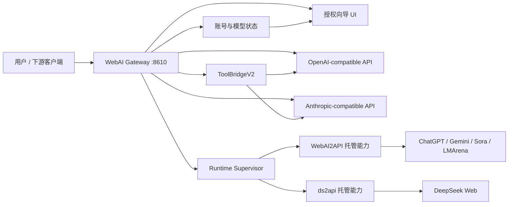

# WebAI Gateway Architecture Map

这份图只面向开发者和开源维护者。产品首页不展示系统架构，用户主流程只保留网页登录授权、模型检测和接入配置。

## Boundaries

- Gateway 对外只暴露本机网页向导和 OpenAI / Anthropic 兼容接口。
- WebAI2API 和 ds2api 作为内部托管能力使用，不在主界面暴露管理型概念。
- Gateway 不执行本地工具，不接管下游客户端的权限系统。
- 登录态、浏览器 profile、运行缓存和凭证目录都属于本机运行态，不进入仓库。
